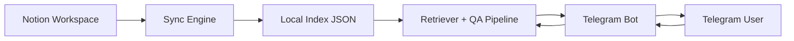

# Notion Telegram Brain (Public Sanitized Edition)

[](./LICENSE)


> Production secrets removed. This repository is safe for public sharing.

## 中文

一个面向个人与小团队的 Telegram + Notion 知识机器人。核心能力是把 Notion 内容持续同步到本地索引，再通过 Telegram 指令完成检索、问答与知识蒸馏。

## 你能用它做什么

- 在 Telegram 里直接问业务问题，不用来回切 Notion
- 定时同步知识库，减少信息过期
- 对 Notion 内容做蒸馏，快速得到可执行摘要
- 通过白名单保护机器人调用权限

## 功能清单

- `/sync` 增量同步 Notion 内容
- `/sync full` 全量重建索引
- `/sync_status` 查看后台同步状态
- `/notion <关键词>` 模糊搜索页面
- `/ask <问题>` 基于知识库问答
- `/learn 标题 | 内容` 手工补充知识
- `/digest` 生成知识蒸馏文档
- `/ping` 健康检查
- `/help` 命令说明

## 架构图



## 演示与截图

- Demo 指令流：`/sync full` -> `/ask 发货通知单自动关闭规则` -> `/digest`
- 截图占位：建议在 `docs/screenshots/` 放入以下文件并在这里替换链接
  - `chat-ask.png`
  - `chat-search.png`
  - `sync-status.png`

## 快速开始

1. 安装依赖

```bash
npm install
```

2. 配置环境变量

```bash
cp .env.example .env
```

3. 编辑 `.env`

- `TELEGRAM_BOT_TOKEN`
- `NOTION_TOKEN`
- `TELEGRAM_ALLOWED_USERS`
- `TELEGRAM_MODE=auto`

4. 构建并启动

```bash
npm run build
npm start
```

## 目录结构

- `src/` 业务代码（同步、检索、问答、Bot）
- `prompts/` 提示词与人格层模板
- `selves/` 数字工作体样例
- `data/example-index.json` 脱敏示例数据
- `docs/sanitization.md` 脱敏发布说明

## 安全与发布

公开发布前执行：

```bash
npm run security:scan
```

更多信息见 [SECURITY.md](./SECURITY.md)。

## 路线图

- [ ] SQLite 持久化索引
- [ ] 向量检索与语义召回
- [ ] 证据高亮与引用片段增强
- [ ] 多轮会话记忆策略优化

---

## English

A Telegram + Notion knowledge bot for sync, retrieval, Q&A, and distilled summaries.

## What You Can Do

- Ask work questions directly in Telegram
- Keep local knowledge index fresh via periodic sync
- Generate concise digest notes from Notion content
- Restrict access with allowlist-based bot control

## Feature List

- `/sync` incremental sync from Notion
- `/sync full` full re-index
- `/sync_status` background sync status
- `/notion <keyword>` fuzzy page search
- `/ask <question>` knowledge-grounded answer
- `/learn title | content` add manual knowledge
- `/digest` generate distilled notes
- `/ping` health check
- `/help` command guide

## Architecture


## Quick Start

1. Install dependencies

```bash
npm install
```

2. Setup environment

```bash
cp .env.example .env
```

3. Fill `.env`

- `TELEGRAM_BOT_TOKEN`
- `NOTION_TOKEN`
- `TELEGRAM_ALLOWED_USERS`
- `TELEGRAM_MODE=auto`

4. Build and run

```bash
npm run build
npm start
```

## Security

Before publishing or sharing, run:

```bash
npm run security:scan
```

Read [SECURITY.md](./SECURITY.md) for details.
